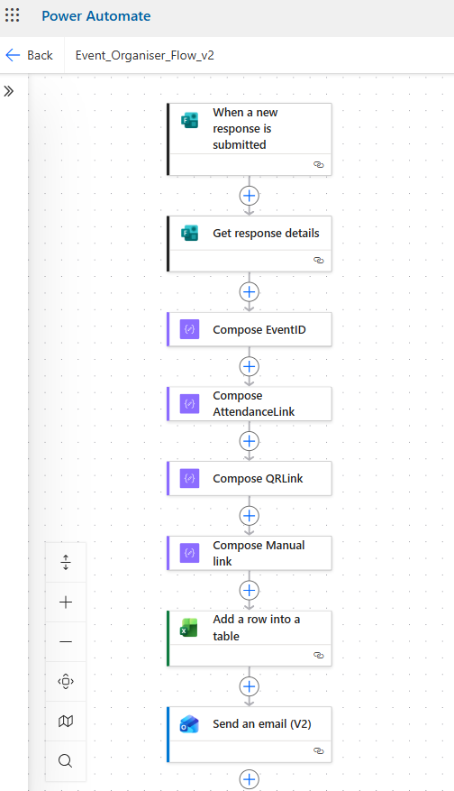
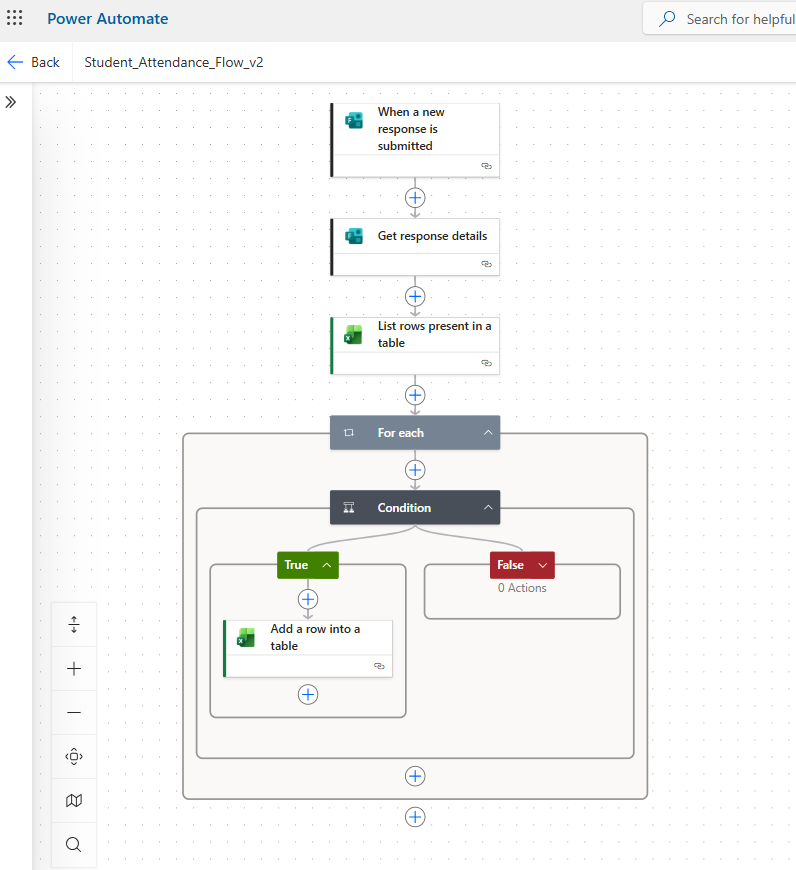
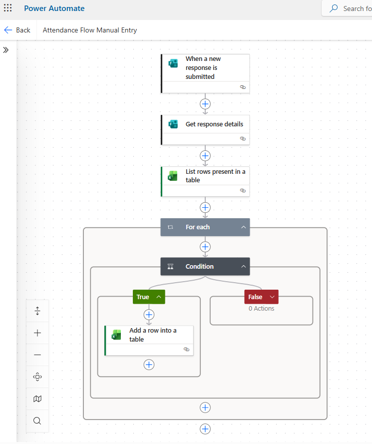
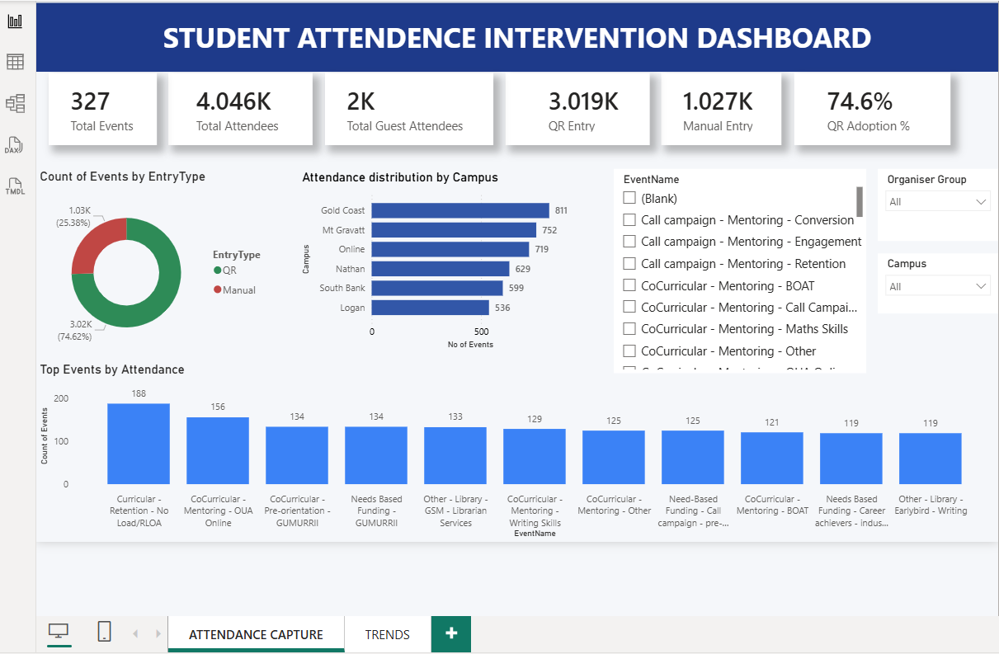
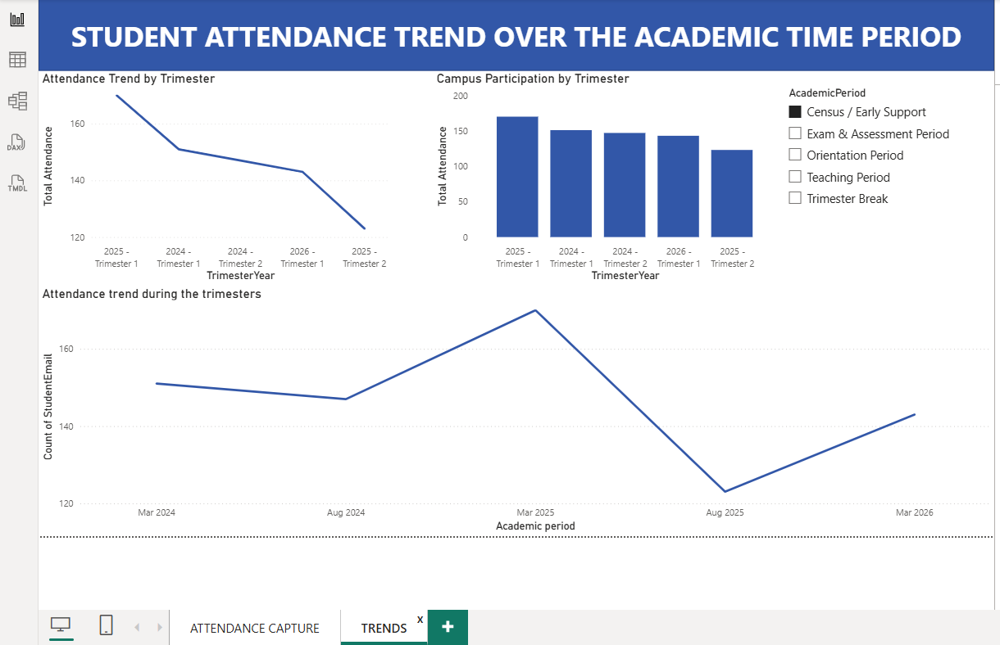

# Automated Student Intervention Attendance System

## 📌 Project Overview

The Automated Student Intervention Attendance System is an Industry Capstone Project developed for Griffith University.

The project was designed to improve and standardise student attendance capture across university events by replacing inconsistent and manual attendance processes with an automated solution.

The system integrates Microsoft Forms, Power Automate, Excel, SharePoint and Power BI to automate event creation, attendance capture, data storage and reporting.

---

## 🎯 Project Objectives

- Standardise student attendance collection
- Reduce manual data entry
- Improve attendance data accuracy
- Generate a unique Event ID for each event
- Generate event-specific QR codes automatically
- Provide QR and manual attendance options
- Store event and attendance information centrally
- Provide attendance analytics through Power BI

---

## 🏗️ Solution Architecture

The solution consists of three main automated workflows:

### 1. Event Organiser Flow

Event organisers submit event details using Microsoft Forms.

Power Automate then:

- Retrieves the submitted event information
- Generates a unique Event ID
- Creates an attendance link
- Generates an event-specific QR code
- Creates a manual attendance link
- Stores event information in the Event Database
- Sends event information to the organiser

### 2. QR Attendance Flow

Students scan the QR code generated specifically for the event.

The attendance workflow retrieves the corresponding event information and records the student's attendance in the Attendance Database.

Students are not required to manually enter the Event ID or Event Name, helping reduce incorrect event information.

### 3. Manual Attendance Flow

A manual attendance process is provided as a fallback when QR attendance cannot be used.

The workflow retrieves the associated event information and stores the attendance record in the Attendance Database.

---

## 📊 Power BI Dashboard

Power BI was used to transform attendance data into interactive dashboards.

The dashboard provides insights including:

- Total events
- Total attendees
- Guest attendance
- QR attendance
- Manual attendance
- QR adoption rate
- Attendance distribution by campus
- Top events by attendance
- Attendance trends across academic periods
- Campus participation by trimester

---

## 🛠️ Technologies Used

| Technology | Purpose |
|---|---|
| Microsoft Forms | Event and attendance data collection |
| Power Automate | Workflow automation |
| Microsoft Excel | Event and attendance data storage |
| SharePoint | Centralised file/data management |
| Power BI | Data modelling, analysis and visualisation |
| QR Codes | Event-specific attendance access |

---

## 🔄 System Workflow

Event Organiser Form  
↓  
Power Automate  
↓  
Generate Event ID  
↓  
Generate Attendance Link & QR Code  
↓  
Event Database  
↓  
Student Scans QR Code  
↓  
Student Attendance Form  
↓  
Power Automate  
↓  
Attendance Database  
↓  
Power BI Dashboard

---

## 📸 Project Screenshots

### Event Organiser Automation

### QR Attendance Automation

### Manual Attendance Automation

### Attendance Dashboard

### Attendance Trends

---

## 📚 Documentation

Detailed project documentation is available in the [docs](docs/) folder.

---

## 💡 Skills Demonstrated

- Business process automation
- Data collection and validation
- Workflow design
- Power Automate development
- Data modelling
- Dashboard development
- Power BI visualisation
- Requirements analysis
- Data quality improvement
- Microsoft 365 integration

---

## 🔒 Data Privacy

The repository contains project demonstrations and screenshots only. No confidential student information or personally identifiable student data is included.
